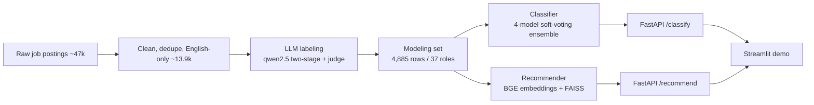

# TalentFit - Job Market Intelligence System

> Read any job posting, know the role. Upload any resume, get ranked, explained job matches. Fully offline, no paid APIs.


> **Personal portfolio fork with enhancements** - the trained model weights are hosted on the
> Hugging Face Hub, there is a one-click live Streamlit demo, an improved README, and repo
> packaging cleanups. Based on the SDA AI Engineering Bootcamp Group 4 project.

TalentFit is a two-part AI system for the job market, built on ~14k cleaned Saudi
job postings. It **classifies** a job description into one of 11 tech roles with a
soft-voting ensemble, and **recommends** the best-fit jobs for a candidate resume with
semantic + skill-aware matching - and it explains *why* each job fits. Everything runs
locally: no paid API keys, and the recommendation path needs no LLM at all.

---

## 🚀 Live Demo

**Try it in your browser:** [TalentFit on Hugging Face Spaces](https://huggingface.co/spaces/Yazeed337/talentfit-demo)

<!-- If you rename the Space, update this URL. -->

Upload a resume and get ranked, explained job matches, or classify a job description into one of
11 tech roles - no setup, running entirely on the hosted Space.

## 📦 Model Weights

The trained ensemble (TF-IDF + BGE heads, DistilBERT, ModernBERT) is **not stored in this repo** -
the transformer weights exceed GitHub's 100 MB per-file limit. They are hosted on the Hugging Face
Hub and downloaded automatically on first run:

- **Model repo:** [`Yazeed337/talentfit`](https://huggingface.co/Yazeed337/talentfit)
- Fetched with `huggingface_hub.snapshot_download` into `02_src/models/best_model/`, after which the
  existing `predict.py` / `recommend.py` load them with no code changes.
- Stored in **fp16** (predictions identical to fp32, half the download).

```bash
pip install huggingface_hub
huggingface-cli download Yazeed337/talentfit --local-dir 02_src/models/best_model
```

---

## Table of Contents

- [Live Demo](#-live-demo)
- [Model Weights](#-model-weights)

- [Highlights](#highlights)
- [Key Results](#key-results)
- [Features](#features)
- [Tech Stack](#tech-stack)
- [Architecture](#architecture)
- [Getting Started](#getting-started)
- [Usage](#usage)
- [API Reference](#api-reference)
- [How It Works](#how-it-works)
- [Project Structure](#project-structure)
- [Model Card](#model-card)
- [Testing and Validation](#testing-and-validation)
- [Configuration](#configuration)
- [Limitations](#limitations)
- [Team](#team)
- [License](#license)

---

## Highlights

- **Two products, one corpus** - a job-description classifier and a resume-to-jobs recommender, both served from the same cleaned, labeled dataset.
- **Explained matches** - every recommendation lists matched skills, missing skills, and a plain-language reason. 82% of surveyed users said they want a reason for each match.
- **Runs fully offline** - classification and recommendation need no external API. The only optional LLM feature (resume tips) uses a local Ollama model.
- **Graceful degradation everywhere** - GPU falls back to CPU, BGE falls back to MiniLM, FAISS falls back to NumPy, and a failed ensemble member is dropped and the rest renormalized.
- **Reproducible** - fixed seed, frozen train/val/test split with integrity guards, cached embeddings and models ship with the repo so nothing needs rebuilding to run.

## Key Results

| Task | Metric | Score |
|------|--------|-------|
| Classification (11 tech roles, held-out test, n=199) | Accuracy | **0.94** |
| Classification | Macro-F1 | **0.943** |
| Classification on 60 real resumes (out-of-distribution) | Accuracy | **~88%** |
| Recommendation - Best Match (hybrid) | Precision@5 / MRR | **0.90 / 1.00** |
| Recommendation - Fast Search (embedding) | Precision@5 / MRR | 0.80 / 0.71 |

See `03_assets/` for confusion matrices and benchmark tables.

---

## Features

**Classification**
- Predicts one of 11 tech roles from a job description alone (job titles are deliberately excluded to avoid label leakage).
- Soft-voting ensemble of four complementary models (lexical, semantic, and two transformers) tuned on a validation set.
- Single and batch endpoints; returns the top class, confidence, and the full probability distribution.

**Recommendation**
- **Fast Search** - pure semantic embedding search between the candidate profile and precomputed job vectors (FAISS), sub-second.
- **Best Match** - retrieves semantically, then re-ranks by skill coverage and experience fit (80% skills+experience, 20% semantic).
- A relevance guardrail returns "no matches" for off-domain or nonsensical queries instead of confidently returning irrelevant jobs.

**Skill intelligence**
- An LLM-built technical skill vocabulary (~430 skills) with alias/synonym resolution and context-aware matching (so "cleaned windows" is not tagged as the Windows OS skill).
- Evidence-grounded resume tips (optional): the app finds skills the resume already proves vs genuine gaps, and points at a free learning resource for each gap. Every claim is tied back to a real resume sentence, so nothing is fabricated.

**Serving**
- A small FastAPI service with auto-generated Swagger docs.
- A Streamlit demo where a candidate uploads a resume and sees ranked, explained matches.
- One-command Docker image that bakes in the models, embeddings, and CPU PyTorch for a self-contained run.

---

## Tech Stack

| Layer | Technology |
|-------|-----------|
| Language | Python 3.12 / 3.13 |
| Deep learning | PyTorch, HuggingFace Transformers (DistilBERT, ModernBERT) |
| Embeddings | sentence-transformers (`BAAI/bge-base-en-v1.5`, fallback `all-MiniLM-L6-v2`) |
| Classical ML | scikit-learn (TF-IDF + Logistic Regression) |
| Vector search | FAISS (`IndexFlatIP`, exact cosine on normalized vectors) |
| API | FastAPI, Pydantic, Uvicorn |
| UI | Streamlit |
| Resume parsing | PyPDF2 |
| Data labeling (offline, one-time) | Ollama running `qwen2.5` (32b + LLM-as-judge) |
| Experiment tracking (optional) | Weights and Biases |
| Persistence and plots | joblib, matplotlib, seaborn, tqdm |
| Packaging | Docker |

> PyTorch is intentionally not pinned in `requirements.txt` so you get the right CPU/GPU
> build for your machine. Installing the requirements pulls a working CPU build automatically.

---

## Architecture

TalentFit is a modular, configuration-driven data pipeline. The API is a thin HTTP layer;
all model logic lives in importable scripts, and the ensemble is described entirely by
`ensemble.json` + `metadata.json` (so weights or members can change without touching code).



Text view of the runtime request paths:

```text
                 +-------------------+
   job text ---> | POST /classify    | ---> predict.py  ---> soft-vote ensemble ---> {role, confidence, scores}
                 +-------------------+
                 +-------------------+
   resume   ---> | POST /recommend   | ---> recommend.py ---> BGE encode + FAISS  ---> ranked, explained jobs
                 +-------------------+
                          ^
                          |  Streamlit UI (upload resume -> profile -> matches -> resume tips)
```

Key design decisions:
- **Description-only classification.** Labels were derived from titles, so training on the title would leak the label. The model reads the cleaned description only.
- **Dedupe before split.** Reposted jobs under new IDs are removed before the train/test split, so identical text can never leak across the boundary and inflate accuracy.
- **Three complementary long-context strategies.** ~50% of postings exceed 512 tokens, so the ensemble reads long documents three ways: DistilBERT@512, ModernBERT@1024 (native long attention), and BGE that chunks and pools the whole document.
- **Lazy singletons.** Models, embeddings, and the FAISS index load once per process and are cached, so requests are interactive.

---

## Getting Started

### Requirements

- Python 3.12 or 3.13 (a virtual environment is recommended)
- The packages in `requirements.txt` (numpy, pandas, scikit-learn, scipy, sentence-transformers, transformers, faiss-cpu, fastapi, uvicorn, pydantic, streamlit, PyPDF2, joblib, matplotlib, seaborn, tqdm, requests, aiohttp)
- A GPU is optional; the transformer models fall back to CPU automatically
- Ollama is NOT required to run the app - it is only used to regenerate the labeled dataset and for the optional resume-tips feature

### Installation

Run everything from the `02_src/` directory (paths below are relative to it).

```bash
cd 02_src
python -m venv .venv

# Windows
.venv\Scripts\pip install -r ../requirements.txt

# macOS / Linux
.venv/bin/pip install -r ../requirements.txt
```

> On first run the BGE encoder (`BAAI/bge-base-en-v1.5`, ~400 MB) and the trained ensemble
> weights (from [`Yazeed337/talentfit`](https://huggingface.co/Yazeed337/talentfit)) download
> from the Hugging Face Hub into `models/best_model/`; after that the app runs offline. See
> [Model Weights](#-model-weights) above.

---

## Usage

All commands are run from `02_src/`.

```bash
# 1) Inference API  ->  Swagger UI at http://127.0.0.1:8000/docs
.venv\Scripts\uvicorn app:app --reload

# 2) Classify one job description
.venv\Scripts\python scripts\predict.py --text "We need a Kubernetes engineer for CI/CD on AWS"

# 3) Classify a CSV (must have a 'job_description' column)
.venv\Scripts\python scripts\predict.py --csv new_jobs.csv --output out.csv

# 4) Recommendation benchmark (embedding vs hybrid)
.venv\Scripts\python scripts\recommend.py

# 5) Candidate demo UI (start the API first, then:)
.venv\Scripts\streamlit run streamlit_app.py
```

### Run with Docker

The `Dockerfile` builds a self-contained image: trained models, precomputed embeddings/index,
the CPU build of PyTorch, and the BGE encoder are all baked in.

```bash
# from 02_src/
docker build -t talentfit .
docker run -p 8000:8000 -p 8501:8501 talentfit

# optional: enable the resume-tips LLM feature using Ollama on the host
docker run -p 8000:8000 -p 8501:8501 -e OLLAMA_URL=http://host.docker.internal:11434 talentfit
```

Then open:
- API + Swagger docs: http://localhost:8000/docs
- Streamlit demo: http://localhost:8501

---

## API Reference

| Method and path | Purpose |
|-----------------|---------|
| `GET  /health` | Liveness + active model |
| `GET  /roles` | List the targetable recommendation roles |
| `POST /classify` | Classify one job description |
| `POST /classify/batch` | Classify many descriptions at once |
| `POST /recommend` | Rank jobs for a candidate (`embedding` or `hybrid`) |

Example - classify:

```bash
curl -X POST http://127.0.0.1:8000/classify \
  -H "Content-Type: application/json" \
  -d "{ \"description\": \"Build ETL pipelines with Spark and Airflow, design data warehouses\" }"
```

Example - recommend:

```bash
curl -X POST http://127.0.0.1:8000/recommend \
  -H "Content-Type: application/json" \
  -d "{
    \"skills\": \"Python, SQL, Airflow, Spark, ETL\",
    \"target_roles\": [\"Data Engineer\"],
    \"experience\": \"4 years building data pipelines\",
    \"strategy\": \"hybrid\",
    \"min_score\": 0.3 }"
```

---

## How It Works

### 1. Data and labeling (offline, one-time)
~46.9k raw Saudi postings are cleaned (HTML strip, Arabic-to-English locations, dedupe,
English-only) down to ~13.9k. A local LLM (Ollama `qwen2.5`) labels each posting from its
**duties**, not its title, to avoid title bias. Two independent passes are compared, and an
LLM-as-judge resolves disagreements. Keeping only roles with at least 50 examples yields the
4,885-row modeling set across 37 roles.

### 2. Classification ensemble (11 tech roles)
Four models are trained on the description text and mixed by a soft vote whose weights were
tuned on the validation set:

| Member | Type | Weight | Role in the ensemble |
|--------|------|--------|----------------------|
| TF-IDF + Logistic Regression | Lexical (word + char n-grams) | 0.30 | Exact tech keywords (Kubernetes, ETL) |
| BGE-chunked + Logistic Regression | Semantic embedding, whole doc | 0.20 | Meaning across the full document |
| DistilBERT @ 512 tokens | Fine-tuned transformer | 0.30 | Contextual, mid-length |
| ModernBERT @ 1024 tokens | Fine-tuned long-context transformer | 0.20 | Long postings (native long attention) |

The members make different mistakes, so the ensemble beats every single model.

### 3. Recommendation
Job descriptions are embedded once with BGE and cached to a FAISS index. A candidate profile
(skills + experience) is encoded, retrieved by cosine similarity, then (for Best Match)
re-ranked by skill coverage and experience fit. Skills are extracted with a whole-word matcher
over the LLM-built vocabulary, and each match is explained.

---

## Project Structure

```text
.
|-- 01_data/                      Source datasets and LLM labels
|-- 02_src/                       Code (runnable as-is)
|   |-- app.py                    FastAPI service
|   |-- streamlit_app.py          Resume-upload demo UI
|   |-- scripts/
|   |   |-- predict.py            Ensemble inference (classification)
|   |   |-- recommend.py          Embedding + hybrid recommendation
|   |   |-- benchmark_classifiers.py, optimize_classifiers.py   Training
|   |   |-- extract_skills.py, skill_vocab.py, resume_evidence.py   Skill layer
|   |-- Backend/                  Offline LLM-labeling pipeline
|   |-- models/best_model/        Trained ensemble + ensemble.json / metadata.json
|   |-- data/processed/           cleaned_data.csv, BGE embeddings, splits
|   |-- cvs_test/                 Validation on real resumes
|   |-- Dockerfile
|-- 03_assets/                    Confusion matrices, comparison tables, logo
|-- requirements.txt
`-- README.md
```

> The derived artifacts the app loads at run time (cleaned data, BGE embeddings, FAISS index,
> train/val/test splits) ship inside `02_src/data/processed/`, so the system runs without
> rebuilding anything.

---

## Model Card

- **Scope:** tech roles only (11 classes). Non-tech postings are forced into the nearest tech class.
- **Feature:** cleaned `job_description`, no job title.
- **Classes:** AI Engineer, Business Analyst, Cloud Engineer, Cybersecurity Analyst, Data Analyst, Data Engineer, Data Scientist, DevOps Engineer, Product Manager, QA Engineer, Software Engineer.
- **Test performance:** accuracy 0.94, macro-F1 0.943 (n=199), seed 42.
- **Combination:** `probs = sum(weight_i * predict_proba_i(text))`, argmax over the shared class order.
- **Validation:** ~88% on 60 real resumes from a public HuggingFace dataset.

---

## Testing and Validation

- **Held-out test set** - the frozen 70/15/15 split (seed 42) is reused across every model, with an integrity guard that refuses to run if the pickled split no longer matches the data.
- **Real-resume check** - `cvs_test/test_real_cvs.py` runs the full production path (skill extraction -> classification -> recommendation) on real CVs and reports accuracy.
- **Recommendation benchmark** - `scripts/recommend.py` reports Precision@k, Recall@k, and MRR for both strategies.

```bash
cd 02_src
.venv\Scripts\python cvs_test\test_real_cvs.py
.venv\Scripts\python scripts\recommend.py
```

---

## Configuration

- **No paid API keys** are required. The core app (classify + recommend) runs with no LLM.
- The only LLM-backed feature is the optional resume-tips button. It calls a local Ollama model
  and auto-detects whatever is installed (prefers the largest local `qwen2.5`, falls back to any
  available model).
- Locally, Ollama is found at `http://localhost:11434`. From Docker, pass
  `-e OLLAMA_URL=http://host.docker.internal:11434`. Override the model with `OLLAMA_MODEL`.

---

## Limitations

- The classifier covers the 11 tech roles; non-tech postings are mapped to the nearest tech class (low confidence signals out-of-domain input).
- Recommendation metrics use a synthetic (skill-overlap) relevance set, not human labels.
- English only; very long resumes are truncated by the transformer token limits (512 / 1024).

---

## Team

**SDA AI Engineering Bootcamp - Group 4** (with WeCloudData)

- Abdulwahab Almusharraf
- Raghad Khan
- Thamer Al Otaibi
- Yazeed Alshawmar

---

## License

Released under the MIT License. See `LICENSE` for details.
